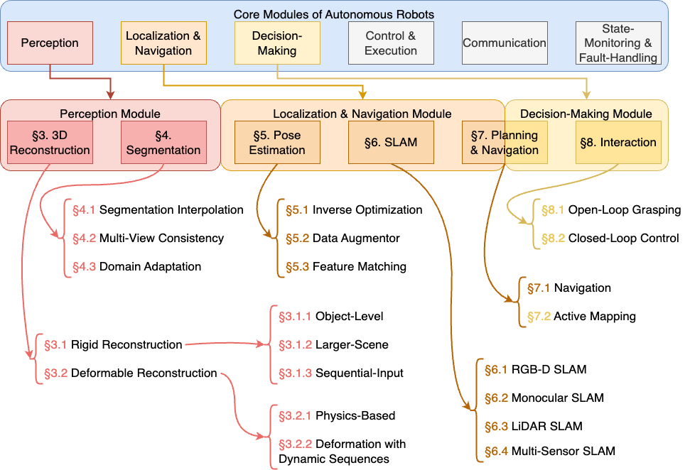

This is a repository dedicated to our publication **Benchmarking Neural Radiance Fields for Autonomous Robots: An Overview**, which provides a comprehensive overview of the state-of-the-art research on neural radiance fields (NeRFs) in the context of autonomous robots. We categorize the research into the following main areas: 3D reconstruction, segmentation, pose estimation, SLAM, planning and navigation and interaction. We also provide links to the original papers, code repositories, and websites for each research work.

If you think this repo is useful, please consider citing our paper:

```bibtex
@misc{ming2024benchmarkingneuralradiancefields,
      title={Benchmarking Neural Radiance Fields for Autonomous Robots: An Overview}, 
      author={Yuhang Ming and Xingrui Yang and Weihan Wang and Zheng Chen and Jinglun Feng and Yifan Xing and Guofeng Zhang},
      year={2024},
      eprint={2405.05526},
      archivePrefix={arXiv},
      primaryClass={cs.RO},
      doi={https://doi.org/10.1016/j.engappai.2024.109685},
      url={https://arxiv.org/abs/2405.05526}, 
}
```


## Related Work
- **Implicit neural representation in medical imaging: A comparative survey**, 2023. [[Paper](https://doi.org/10.1109/ICCVW60793)]
- **3d gaussian as a new vision era: A survey**, 2024. [[Paper](https://arxiv.org/abs/2402.07181)]
- **A survey on 3d gaussian splatting**, 2024. [[Paper](https://arxiv.org/abs/2401.03890)]
- **How nerfs and 3d gaussian splatting are reshaping slam: a survey**, 2024. [[Paper](https://arxiv.org/abs/2402.13255)]
- **Neural radiance field in autonomous driving: A survey**, 2024. [[Paper](https://arxiv.org/abs/2404.13816)]
- **Nerf in robotics: A survey**, 2024. [[Paper](https://arxiv.org/abs/2405.01333)]

## 3D Reconstruction

- **360Roam: Real-Time Indoor Roaming Using Geometry-Aware 360∘ Radiance Fields**, *arXiv*, 2022. [Paper](https://arxiv.org/abs/2208.02705)
- **3D Reconstruction and New View Synthesis of Indoor Environments based on a Dual Neural Radiance Field**, *arXiv*, 2024. [Paper](https://arxiv.org/abs/2401.14726)
- **Anti-Aliased Neural Implicit Surfaces with Encoding Level of Detail**, *SIGGRAPH Asia 2023 Conference Papers*, 2023. [Paper](https://arxiv.org/abs/2310.01999)
- **BNV-Fusion: Dense 3D Reconstruction using Bi-level Neural Volume Fusion**, *2022 IEEE/CVF Conference on Computer Vision and Pattern Recognition (CVPR)*, 2022 [Paper](https://arxiv.org/abs/2204.01139) | [Code](https://github.com/likojack/bnv_fusion).
- **Continual Neural Mapping: Learning An Implicit Scene Representation from Sequential Observations**, *2021 IEEE/CVF International Conference on Computer Vision (ICCV)*, 2021. [Paper](https://arxiv.org/abs/2111.13227)
- **Coordinate Quantized Neural Implicit Representations for Multi-view Reconstruction**, *2023 IEEE/CVF International Conference on Computer Vision (ICCV)*, 2023. [Paper](https://arxiv.org/abs/2306.01929)
- **D-NeRF: Neural Radiance Fields for Dynamic Scenes**, *2021 IEEE/CVF Conference on Computer Vision and Pattern Recognition (CVPR)*, 2021. [Paper](https://arxiv.org/abs/2011.13961) | [Code](https://github.com/albertpumarola/D-NeRF) | [Website](https://www.albertpumarola.com/research/D-NeRF/)
- **D\^2NeRF: Self-Supervised Decoupling of Dynamic and Static Objects from a Monocular Video**, *Advances in Neural Information Processing Systems 35, NeurIPS*, 2022 [Paper](https://arxiv.org/abs/2205.15838) | [Code](https://github.com/ChikaYan/d2nerf) | [Website](https://d2nerf.github.io/).
- **EventNeRF: Neural Radiance Fields from a Single Colour Event Camera**, *2023 IEEE/CVF Conference on Computer Vision and Pattern Recognition (CVPR)*, 2023. [Paper](https://doi.org/10.1109/CVPR52729)
- **Few-Shot Neural Radiance Fields under Unconstrained Illumination**, *Thirty-Eighth AAAI Conference on Artificial Intelligence, AAAI*, 2024 [Paper](https://arxiv.org/abs/2303.11728) | [Website](https://seokyeong94.github.io/ExtremeNeRF/).
- **FreeNeRF: Improving Few-Shot Neural Rendering with Free Frequency Regularization**, *2023 IEEE/CVF Conference on Computer Vision and Pattern Recognition (CVPR)*, 2023 [Paper](https://arxiv.org/abs/2303.07418) | [Code](https://github.com/Jiawei-Yang/FreeNeRF) | [Website](https://jiawei-yang.github.io/FreeNeRF).
- **GeCoNeRF: Few-shot Neural Radiance Fields via Geometric Consistency**, *International Conference on Machine Learning, ICML*, 2023 [Paper](https://arxiv.org/abs/2301.10941) | [Code](https://github.com/ku-cvlab/GeCoNeRF) | [Website](https://ku-cvlab.github.io/GeCoNeRF/).
- **GenS: Generalizable Neural Surface Reconstruction from Multi-View Images**, *Advances in Neural Information Processing Systems 36, NeurIPS*, 2023. [Paper](https://arxiv.org/abs/2310.03840) | [Code](https://github.com/prstrive/GenS)
- **Geo-Neus: Geometry-Consistent Neural Implicit Surfaces Learning for Multi-view Reconstruction**, *Advances in Neural Information Processing Systems 35, NeurIPS*, 2022. [Paper](https://arxiv.org/abs/2211.13372)
- **GO-Surf: Neural Feature Grid Optimization for Fast, High-Fidelity RGB-D Surface Reconstruction**, *2022 International Conference on 3D Vision (3DV)*, 2022. [Paper](https://doi.org/10.1109/3DV57658)
- **H2O-SDF: Two-phase Learning for 3D Indoor Reconstruction using Object Surface Fields**, *The Twelfth International Conference on Learning Representations, ICLR*, 2024. [Paper](https://arxiv.org/abs/2310.00218)
- **HelixSurf: A Robust and Efficient Neural Implicit Surface Learning of Indoor Scenes with Iterative Intertwined Regularization**, *2023 IEEE/CVF Conference on Computer Vision and Pattern Recognition (CVPR)*, 2023. [Paper](https://doi.org/10.1109/CVPR52729)
- **HexPlane: A Fast Representation for Dynamic Scenes**, *2023 IEEE/CVF Conference on Computer Vision and Pattern Recognition (CVPR)*, 2023. [Paper](https://arxiv.org/abs/2301.09632) | [Code](https://github.com/Caoang327/HexPlane)
- **HF-NeuS: Improved Surface Reconstruction Using High-Frequency Details**, *Advances in Neural Information Processing Systems 35, NeurIPS*, 2022. [Paper](https://arxiv.org/abs/2212.03506) | [Code](https://github.com/yiqun-wang/HFS)
- **Hi-Map: Hierarchical Factorized Radiance Field for High-Fidelity Monocular Dense Mapping**, *arXiv*, 2024 [Paper](https://arxiv.org/abs/2401.03203) | [Website](https://vlis2022.github.io/fmap/).
- **HyperNeRF: a higher-dimensional representation for topologically varying neural radiance fields**, *ACM Trans. Graph.*, 2021. [Paper](https://arxiv.org/abs/2106.13228) | [Code](https://github.com/google/hypernerf) | [Website](https://hypernerf.github.io/)
- **Improving neural implicit surfaces geometry with patch warping**, *2022 IEEE/CVF Conference on Computer Vision and Pattern Recognition (CVPR)*, 2022. [Paper](https://doi.org/10.1109/CVPR52688) | [Code](https://github.com/fdarmon/NeuralWarp)
- **Instant Neural Graphics Primitives with a Multiresolution Hash Encoding**, *ACM Trans. Graph.*, 2022. [Paper](https://arxiv.org/abs/2201.05989) | [Code](https://github.com/NVlabs/instant-ngp) | [Website](https://nvlabs.github.io/instant-ngp/)
- **iSDF: Real-Time Neural Signed Distance Fields for Robot Perception**, *Robotics: Science and Systems XVIII*, 2022 [Paper](https://arxiv.org/abs/2204.02296) | [Code](https://github.com/facebookresearch/iSDF) | [Website](https://joeaortiz.github.io/iSDF/).
- **K-Planes: Explicit Radiance Fields in Space, Time, and Appearance**, *2023 IEEE/CVF Conference on Computer Vision and Pattern Recognition (CVPR)*, 2023. [Paper](https://arxiv.org/abs/2301.10241) | [Code](https://github.com/sarafridov/K-Planes)
- **Mip-NeRF RGB-D: Depth Assisted Fast Neural Radiance Fields**, *J. WSCG*, 2022 [Paper](https://arxiv.org/abs/2205.09351).
- **MonoSDF: Exploring Monocular Geometric Cues for Neural Implicit Surface Reconstruction**, *Advances in Neural Information Processing Systems 35, NeurIPS*, 2022. [Paper](https://arxiv.org/abs/2206.10517) | [Code](https://github.com/autonomousvision/monosdf)
- **Multiview Neural Surface Reconstruction by Disentangling Geometry and Appearance**, *Advances in Neural Information Processing Systems 33, NeurIPS*, 2020. [Paper](https://arxiv.org/abs/2003.09852) | [Code](https://github.com/lioryariv/idr) | [Website](https://lioryariv.github.io/idr/)
- **MVSNeRF: Fast Generalizable Radiance Field Reconstruction from Multi-View Stereo**, *2021 IEEE/CVF International Conference on Computer Vision (ICCV)*, 2021 [Paper](https://arxiv.org/abs/2103.15595) | [Code](https://github.com/apchenstu/mvsnerf) | [Website](https://apchenstu.github.io/mvsnerf/).
- **NeRF--: Neural Radiance Fields Without Known Camera Parameters**, *arXiv*, 2021 [Paper](https://arxiv.org/abs/2102.07064) | [Code](https://github.com/ActiveVisionLab/nerfmm) | [Website](https://nerfmm.active.vision).
- **NeRF-DS: Neural Radiance Fields for Dynamic Specular Objects**, *2023 IEEE/CVF Conference on Computer Vision and Pattern Recognition (CVPR)*, 2023 [Paper](https://arxiv.org/abs/2303.14435) | [Code](https://github.com/JokerYan/NeRF-DS).
- **Nerfies: Deformable Neural Radiance Fields**, *2021 IEEE/CVF International Conference on Computer Vision (ICCV)*, 2021 [Paper](https://arxiv.org/abs/2011.12948) | [Code](https://github.com/suzhenwang86/nerfies) | [Website](https://nerfies.github.io).
- **NeRFusion: Fusing Radiance Fields for Large-Scale Scene Reconstruction**, *2022 IEEE/CVF Conference on Computer Vision and Pattern Recognition (CVPR)*, 2022. [Paper](https://doi.org/10.1109/CVPR52688) | [Code](https://github.com/jetd1/NeRFusion)
- **Neural 3D Scene Reconstruction with the Manhattan-world Assumption**, *2022 IEEE/CVF Conference on Computer Vision and Pattern Recognition (CVPR)*, 2022. [Paper](https://doi.org/10.1109/CVPR52688)
- **Neural 3D Video Synthesis from Multi-view Video**, *2022 IEEE/CVF Conference on Computer Vision and Pattern Recognition (CVPR)*, 2022. [Paper](https://arxiv.org/abs/2112.03246)
- **Neural Implicit Representations for Physical Parameter Inference from a Single Video**, *2023 IEEE/CVF Winter Conference on Applications of Computer Vision (WACV)*, 2023 [Paper](https://arxiv.org/abs/2204.14030).
- **Neural Impostor: Editing Neural Radiance Fields with Explicit Shape Manipulation**, *Comput. Graph. Forum*, 2023 [Paper](https://arxiv.org/abs/2310.05391).
- **Neural Radiance Flow for 4D View Synthesis and Video Processing**, *2021 IEEE/CVF International Conference on Computer Vision (ICCV)*, 2021 [Paper](https://arxiv.org/abs/2012.09790) | [Code](https://github.com/yilundu/nerflow) | [Website](https://yilundu.github.io/nerflow/).
- **Neural RGB-D Surface Reconstruction**, *2022 IEEE/CVF Conference on Computer Vision and Pattern Recognition (CVPR)*, 2022. [Paper](https://doi.org/10.1109/CVPR52688)
- **Neural Scene Graphs for Dynamic Scenes**, *2021 IEEE/CVF Conference on Computer Vision and Pattern Recognition (CVPR)*, 2021. [Paper](https://arxiv.org/abs/2011.10379) | [Code](https://github.com/princeton-computational-imaging/neural-scene-graphs)
- **NeuralBlox: Real-Time Neural Representation Fusion for Robust Volumetric Mapping**, *2021 International Conference on 3D Vision (3DV)*, 2021 [Paper](https://arxiv.org/abs/2110.09415) | [Code](https://github.com/ethz-asl/neuralblox).
- **NeuralRoom: Geometry-Constrained Neural Implicit Surfaces for Indoor Scene Reconstruction**, *ACM Trans. Graph.*, 2022. [Paper](https://arxiv.org/abs/2206.08848)
- **NeuRIS: Neural Reconstruction of Indoor Scenes Using Normal Priors**, *Computer Vision – ECCV 2022*, 2022. [Paper](https://arxiv.org/abs/2206.13403) | [Code](https://github.com/jingwenwang95/neuris)
- **NeuS: Learning Neural Implicit Surfaces by Volume Rendering for Multi-view Reconstruction**, *Advances in Neural Information Processing Systems 34, NeurIPS*, 2021. [Paper](https://arxiv.org/abs/2106.10689) | [Code](https://github.com/Totoro97/NeuS) | [Website](https://lingjie0206.github.io/papers/NeuS/)
- **NeuSurf: On-Surface Priors for Neural Surface Reconstruction from Sparse Input Views**, *Thirty-Eighth AAAI Conference on Artificial Intelligence, AAAI*, 2024 [Paper](https://doi.org/10.1609/aaai.v38i3.28005) | [Code](https://github.com/yulunwu0108/NeuSurf).
- **NISB-Map: Scalable Mapping With Neural Implicit Spatial Block**, *RAL*, 2023. [Paper](https://arxiv.org/abs/2305.12344)
- **Non-Rigid Neural Radiance Fields: Reconstruction and Novel View Synthesis of a Dynamic Scene From Monocular Video**, *2021 IEEE/CVF International Conference on Computer Vision (ICCV)*, 2021. [Paper](https://arxiv.org/abs/2012.12247) | [Code](https://github.com/facebookresearch/nonrigid_nerf) | [Website](https://gvv.mpi-inf.mpg.de/projects/nonrigid_nerf/)
- **NoPose-NeuS: Jointly Optimizing Camera Poses with Neural Implicit Surfaces for Multi-view Reconstruction**, *Proceedings of UniReps: the First Workshop on Unifying Representations...*, 2023 [Paper](https://arxiv.org/abs/2312.15238).
- **PAC-NeRF: Physics Augmented Continuum Neural Radiance Fields for Geometry-Agnostic System Identification**, *The Eleventh International Conference on Learning Representations, ICLR*, 2023 [Paper](https://arxiv.org/abs/2303.05512) | [Code](https://github.com/xuan-li/PAC-NeRF) | [Website](https://sites.google.com/view/PAC-NeRF).
- **PC-NeRF: Parent-Child Neural Radiance Fields Using Sparse LiDAR Frames in Autonomous Driving Environments**, *arXiv*, 2024 [Paper](https://arxiv.org/abs/2402.09325) | [Code](https://github.com/biter0088/pc-nerf).
- **PIE-NeRF: Physics-based Interactive Elastodynamics with NeRF**, *arXiv*, 2023 [Paper](https://arxiv.org/abs/2311.13099) | [Website](https://fytalon.github.io/pienerf/).
- **Porf: Pose residual field for accurate Neural surface Reconstruction**, *The Twelfth International Conference on Learning Representations, ICLR*, 2024 [Paper](https://arxiv.org/abs/2310.07449) | [Code](https://github.com/ActiveVisionLab/porf) | [Website](https://porf.active.vision).
- **PSDF: Prior-Driven Neural Implicit Surface Learning for Multi-view Reconstruction**, *arXiv*, 2024 [Paper](https://arxiv.org/abs/2401.12751).
- **SHINE-Mapping: Large-Scale 3D Mapping Using Sparse Hierarchical Implicit Neural Representations**, *2023 IEEE International Conference on Robotics and Automation (ICRA)*, 2023. [Paper](https://doi.org/10.1109/ICRA48891) | [Code](https://github.com/PRBonn/SHINE_mapping)
- **SparseNeuS: Fast Generalizable Neural Surface Reconstruction from Sparse Views**, *Computer Vision - ECCV 2022*, 2022. [Paper](https://doi.org/10.1007/978-3-031-19824-3_13) | [Code](https://github.com/xxlong0/SparseNeuS)
- **STaR: Self-supervised Tracking and Reconstruction of Rigid Objects in Motion with Neural Rendering**, *2021 IEEE/CVF Conference on Computer Vision and Pattern Recognition (CVPR)*, 2021. [Paper](https://arxiv.org/abs/2104.11235)
- **TensoIR: Tensorial Inverse Rendering**, *2023 IEEE/CVF Conference on Computer Vision and Pattern Recognition (CVPR)*, 2023. [Paper](https://arxiv.org/abs/2304.02461) | [Code](https://github.com/Haian-Jin/TensoIR)
- **TensoRF: Tensorial Radiance Fields**, *Computer Vision - ECCV 2022*, 2022. [Paper](https://doi.org/10.1007/978-3-031-19824-3_20) | [Code](https://github.com/apchenstu/TensoRF) | [Website](https://apchenstu.github.io/TensoRF/)
- **TensoSDF: Roughness-aware Tensorial Representation for Robust Geometry and Material Reconstruction**, *ACM Trans. Graph.*, 2024 [Paper](https://arxiv.org/abs/2402.02771) | [Code](https://github.com/Riga2/TensoSDF).
- **Towards Real-time Scalable Dense Mapping using Robot-centric Implicit Representation**, *arXiv*, 2023. [Paper](https://arxiv.org/abs/2306.10472) | [Code](https://github.com/HITSZ-NRSL/RIM)
- **UNISURF: Unifying Neural Implicit Surfaces and Radiance Fields for Multi-View Reconstruction**, *2021 IEEE/CVF International Conference on Computer Vision (ICCV)*, 2021. [Paper](https://doi.org/10.1109/ICCV48922) | [Code](https://github.com/autonomousvision/unisurf)
- **VolRecon: Volume Rendering of Signed Ray Distance Functions for Generalizable Multi-View Reconstruction**, *2023 IEEE/CVF Conference on Computer Vision and Pattern Recognition (CVPR)*, 2023. [Paper](https://doi.org/10.1109/CVPR52729) | [Code](https://github.com/yaoyz96/VolRecon)
- **Volume Rendering of Neural Implicit Surfaces**, *Advances in Neural Information Processing Systems 34, NeurIPS*, 2021. [Paper](https://arxiv.org/abs/2106.12052) | [Code](https://github.com/lioryariv/volsdf) | [Website](https://lioryariv.github.io/volsdf/)
- **Vox-Surf: Voxel-Based Implicit Surface Representation**, *IEEE Transactions on Visualization and Computer Graphics*, 2024 [Paper](https://arxiv.org/abs/2208.10925) | [Code](https://github.com/zju3dv/Vox-Surf).
- **Voxurf: Voxel-based Efficient and Accurate Neural Surface Reconstruction**, *The Eleventh International Conference on Learning Representations, ICLR*, 2023. [Paper](https://arxiv.org/abs/2211.14322) | [Code](https://github.com/wutong16/Voxurf)

## Segmentation

- **Decomposing NeRF for Editing via Feature Field Distillation**, *Advances in Neural Information Processing Systems 35, NeurIPS*, 2022 [Paper](https://arxiv.org/abs/2205.15585) | [Code](https://github.com/pfnet-research/distilled-feature-fields) | [Website](https://pfnet-research.github.io/distilled-feature-fields/).
- **DM-NeRF: 3D Scene Geometry Decomposition and Manipulation from 2D Images**, *The Eleventh International Conference on Learning Representations, ICLR*, 2023 [Paper](https://arxiv.org/abs/2208.07227) | [Code](https://github.com/vLAR-group/DM-NeRF).
- **GNeSF: Generalizable Neural Semantic Fields**, *Advances in Neural Information Processing Systems 36, NeurIPS*, 2023 [Paper](https://arxiv.org/abs/2310.15712) | [Code](https://github.com/HLinChen/GNeSF).
- **iLabel: Revealing Objects in Neural Fields**, *RAL*, 2023. [Paper](https://arxiv.org/abs/2209.14840)
- **Instance Neural Radiance Field**, *2023 IEEE/CVF International Conference on Computer Vision (ICCV)*, 2023 [Paper](https://arxiv.org/abs/2304.04395) | [Code](https://github.com/lyclyc52/Instance_NeRF).
- **JacobiNeRF: NeRF Shaping with Mutual Information Gradients**, *2023 IEEE/CVF Conference on Computer Vision and Pattern Recognition (CVPR)*, 2023. [Paper](https://arxiv.org/abs/2304.09484)
- **NeRF-RPN: A general framework for object detection in NeRFs**, *2023 IEEE/CVF Conference on Computer Vision and Pattern Recognition (CVPR)*, 2023. [Paper](https://arxiv.org/abs/2211.11646) | [Video](https://youtu.be/M8_4Ih1CJjE)
- **NeRF: representing scenes as neural radiance fields for view synthesis**, *CACM*, 2021. [Paper](https://dl.acm.org/doi/10.1145/3503250) | [Code](https://github.com/bmild/nerf) | [Website](https://www.matthewtancik.com/nerf) | [Video](https://www.youtube.com/watch?v=JuH79E8rdKc)
- **Nerflets: Local Radiance Fields for Efficient Structure-Aware 3D Scene Representation from 2D Supervision**, *2023 IEEE/CVF Conference on Computer Vision and Pattern Recognition (CVPR)*, 2023. [Paper](https://arxiv.org/abs/2302.12602)
- **NeSF: Neural Semantic Fields for Generalizable Semantic Segmentation of 3D Scenes**, *Transactions on Machine Learning Research*, 2022 [Paper](https://arxiv.org/abs/2111.13260) | [Website](https://nesf3d.github.io/).
- **Panoptic Lifting for 3D Scene Understanding with Neural Fields**, *2023 IEEE/CVF Conference on Computer Vision and Pattern Recognition (CVPR)*, 2023. [Paper](https://arxiv.org/abs/2212.05495)
- **Panoptic NeRF: 3D-to-2D Label Transfer for Panoptic Urban Scene Segmentation**, *2022 International Conference on 3D Vision (3DV)*, 2022. [Paper](https://arxiv.org/abs/2203.07883)
- **Panoptic Neural Fields: A Semantic Object-Aware Neural Scene Representation**, *2022 IEEE/CVF Conference on Computer Vision and Pattern Recognition (CVPR)*, 2022. [Paper](https://arxiv.org/abs/2111.14312)
- **pixelNeRF: Neural Radiance Fields from One or Few Images**, *2021 IEEE/CVF Conference on Computer Vision and Pattern Recognition (CVPR)*, 2021 [Paper](https://arxiv.org/abs/2012.02190) | [Website](https://alexyu.net/pixelnerf).
- **PlanarNeRF: Online Learning of Planar Primitives with Neural Radiance Fields**, *arXiv*, 2024 [Paper](https://arxiv.org/abs/2401.00871).
- **SegNeRF: 3D Part Segmentation with Neural Radiance Fields**, *arXiv*, 2022 [Paper](https://arxiv.org/abs/2211.11215).
- **Semantic Ray: Learning a Generalizable Semantic Field with Cross-Reprojection Attention**, *2023 IEEE/CVF Conference on Computer Vision and Pattern Recognition (CVPR)*, 2023. [Paper](https://arxiv.org/abs/2304.02891)
- **Unsupervised Continual Semantic Adaptation Through Neural Rendering**, *2023 IEEE/CVF Conference on Computer Vision and Pattern Recognition (CVPR)*, 2023. [Paper](https://arxiv.org/abs/2303.12678)

## Pose Estimation 

- **BARF: Bundle-Adjusting Neural Radiance Fields**, *2021 IEEE/CVF International Conference on Computer Vision (ICCV)*, 2021. [Paper](https://arxiv.org/abs/2104.06434)
- **BID-NeRF: RGB-D image pose estimation with inverted Neural Radiance Fields**, *arXiv*, 2023 [Paper](https://arxiv.org/abs/2310.03563).
- **CBARF: Cascaded Bundle-Adjusting Neural Radiance Fields from Imperfect Camera Poses**, *arXiv*, 2023 [Paper](https://arxiv.org/abs/2310.09776).
- **CROSSFIRE: Camera Relocalization On Self-Supervised Features from an Implicit Representation**, *2023 IEEE/CVF International Conference on Computer Vision (ICCV)*, 2023. [Paper](https://arxiv.org/abs/2303.04869)
- **DroNeRF: Real-Time Multi-Agent Drone Pose Optimization for Computing Neural Radiance Fields**, *2023 IEEE/RSJ International Conference on Intelligent Robots and Systems (IROS)*, 2023 [Paper](https://arxiv.org/abs/2303.04322).
- **Feature Query Networks: Neural Surface Description for Camera Pose Refinement**, *2022 IEEE/CVF Conference on Computer Vision and Pattern Recognition Workshops (CVPRW)*, 2022. [Paper](https://arxiv.org/abs/2206.04873)
- **Implicit Map Augmentation for Relocalization**, *Computer Vision - ECCV 2022 Workshops*, 2022. [Paper](https://arxiv.org/abs/2210.05082)
- **iNeRF: Inverting Neural Radiance Fields for Pose Estimation**, *2021 IEEE/RSJ International Conference on Intelligent Robots and Systems (IROS)*, 2021. [Paper](https://doi.org/10.1109/IROS51168) | [Code](https://github.com/yenchenlin/iNeRF-public) | [Website](https://yenchenlin.me/inerf/) | [Dataset](https://github.com/BerkeleyAutomation/dex-nerf-datasets)
- **IR-MCL: Implicit Representation-Based Online Global Localization**, *RAL*, 2023. [Paper](https://arxiv.org/abs/2210.03113) | [Code](https://github.com/PRBonn/ir-mcl)
- **LATITUDE: Robotic Global Localization with Truncated Dynamic Low-pass Filter in City-scale NeRF**, *2023 IEEE International Conference on Robotics and Automation (ICRA)*, 2023. [Paper](https://doi.org/10.1109/ICRA48891)
- **LENS: Localization enhanced by NeRF synthesis**, *Conference on Robot Learning, CoRL 2021*, 2021. [Paper](https://arxiv.org/abs/2110.06558) | [Video](https://www.youtube.com/watch?v=DgIpVoS6ejY)
- **Loc-NeRF: Monte Carlo Localization using Neural Radiance Fields**, *2023 IEEE International Conference on Robotics and Automation (ICRA)*, 2023. [Paper](https://doi.org/10.1109/ICRA48891) | [Code](https://github.com/MIT-SPARK/Loc-NeRF)
- **Mega-NeRF: Scalable Construction of Large-Scale NeRFs for Virtual Fly- Throughs**, *2022 IEEE/CVF Conference on Computer Vision and Pattern Recognition (CVPR)*, 2022. [Paper](https://doi.org/10.1109/CVPR52688) | [Code](https://github.com/cmusatyalab/mega-nerf)
- **NeRF in the Wild: Neural Radiance Fields for Unconstrained Photo Collections**, *2021 IEEE/CVF Conference on Computer Vision and Pattern Recognition (CVPR)*, 2021. [Paper](https://doi.org/10.1109/CVPR46437)
- **NeRF-IBVS: Visual Servo Based on NeRF for Visual Localization and Navigation**, *Advances in Neural Information Processing Systems 36, NeurIPS*, 2023. [Paper](https://arxiv.org/abs/2305.06760)
- **nerf2nerf: Pairwise Registration of Neural Radiance Fields**, *2023 IEEE International Conference on Robotics and Automation (ICRA)*, 2023. [Paper](https://doi.org/10.1109/ICRA48891) | [Code](https://github.com/nerf2nerf/nerf2nerf) | [Website](https://nerf2nerf.github.io/) | [Dataset](https://drive.google.com/drive/folders/1jNpwAv1T1ntjIHUMJ1wABePA2Z8_nRRQ)
- **Nerfels: Renderable Neural Codes for Improved Camera Pose Estimation**, *2022 IEEE/CVF Conference on Computer Vision and Pattern Recognition Workshops (CVPRW)*, 2022. [Paper](https://arxiv.org/abs/2202.01455)
- **NoPe-NeRF: Optimising Neural Radiance Field with No Pose Prior**, *2023 IEEE/CVF Conference on Computer Vision and Pattern Recognition (CVPR)*, 2023. [Paper](https://doi.org/10.1109/CVPR52729)
- **Parallel Inversion of Neural Radiance Fields for Robust Pose Estimation**, *2023 IEEE International Conference on Robotics and Automation (ICRA)*, 2023. [Paper](https://arxiv.org/abs/2210.05441)
- **PNeRFLoc: Visual Localization with Point-Based Neural Radiance Fields**, *Thirty-Eighth AAAI Conference on Artificial Intelligence, AAAI*, 2024 [Paper](https://arxiv.org/abs/2312.10649) | [Code](https://github.com/BoMingZhao/PNeRFLoc) | [Website](https://zju3dv.github.io/PNeRFLoc/).
- **Point-NeRF: Point-based Neural Radiance Fields**, *2022 IEEE/CVF Conference on Computer Vision and Pattern Recognition (CVPR)*, 2022. [Paper](https://doi.org/10.1109/CVPR52688) | [Code](https://github.com/Xharlie/pointnerf) | [Website](https://xharlie.github.io/projects/project_sites/pointnerf/)
- **Reg-NF: Efficient Registration of Implicit Surfaces within Neural Fields**, *2024 IEEE International Conference on Robotics and Automation (ICRA)*, 2024. [Paper](https://arxiv.org/abs/2402.09722)
- **Self-Calibrating Neural Radiance Fields**, *2021 IEEE/CVF International Conference on Computer Vision (ICCV)*, 2021. [Paper](https://doi.org/10.1109/ICCV48922)
- **SPARF: Neural Radiance Fields from Sparse and Noisy Poses**, *2023 IEEE/CVF Conference on Computer Vision and Pattern Recognition (CVPR)*, 2023. [Paper](https://arxiv.org/abs/2211.14091)
- **The NeRFect Match: Exploring NeRF Features for Visual Localization**, *arXiv*, 2024 [Paper](https://arxiv.org/abs/2403.09577) | [Code](https://github.com/nv-dvl/nerfmatch) | [Website](https://nerfmatch.github.io).

## SLAM

- **A Real-Time Visual-Inertial SLAM with Neural Radiance Fields Mapping**, *Proceedings of the 3rd International Conference on Computer, Artificial Intelligence an...*, 2024 [Paper](https://www.semanticscholar.org/paper/A-Real-Time-Visual-Inertial-SLAM-with-Neural-Fields-Bai/01fb65a906a8293838d58b33ca46e9f4810b4467).
- **Co-SLAM: Joint Coordinate and Sparse Parametric Encodings for Neural Real-Time SLAM**, *2023 IEEE/CVF Conference on Computer Vision and Pattern Recognition (CVPR)*, 2023 [Paper](https://arxiv.org/abs/2304.14377) | [Code](https://github.com/HengyiWang/Co-SLAM) | [Website](https://hengyiwang.github.io/projects/CoSLAM).
- **DDN-SLAM: Real-time Dense Dynamic Neural Implicit SLAM with Joint Semantic Encoding**, *arXiv*, 2024 [Paper](https://arxiv.org/abs/2401.01545).
- **Dense RGB Slam with Neural Implicit Maps**, *The Eleventh International Conference on Learning Representations, ICLR*, 2023. [Paper](https://arxiv.org/abs/2301.08930) | [Code](https://github.com/HKUST-3DV/DIM-SLAM) | [Website](https://poptree.github.io/DIM-SLAM/)
- **DN-SLAM: A Visual SLAM With ORB Features and NeRF Mapping in Dynamic Environments**, *IEEE Sensors Journal*, 2024 [Paper](https://doi.org/10.1109/JSEN.2023.3345877).
- **DynaMoN: Motion-Aware Fast and Robust Camera Localization for Dynamic Neural Radiance Fields**, *arXiv*, 2023 [Paper](https://arxiv.org/abs/2309.08927) | [Code](https://github.com/HannahHaensen/DynaMoN) | [Website](https://hannahhaensen.github.io/DynaMoN/).
- **End-to-End RGB-D SLAM With Multi-MLPs Dense Neural Implicit Representations**, *RAL*, 2023. [Paper](https://doi.org/10.1109/LRA.2023.3311363)
- **ESLAM: Efficient Dense SLAM System Based on Hybrid Representation of Signed Distance Fields**, *2023 IEEE/CVF Conference on Computer Vision and Pattern Recognition (CVPR)*, 2023. [Paper](https://arxiv.org/abs/2211.11704) | [Code](https://github.com/idiap/ESLAM)
- **GO-SLAM: Global Optimization for Consistent 3D Instant Reconstruction**, *2023 IEEE/CVF International Conference on Computer Vision (ICCV)*, 2023. [Paper](https://arxiv.org/abs/2309.02436) | [Code](https://github.com/youmi-zym/GO-SLAM) | [Website](https://youmi-zym.github.io/projects/GO-SLAM/)
- **HI-SLAM: Monocular Real-Time Dense Mapping With Hybrid Implicit Fields**, *RAL*, 2024. [Paper](https://arxiv.org/abs/2310.04787) | [Website](https://hi-slam.github.io/)
- **iMAP: Implicit Mapping and Positioning in Real-Time**, *2021 IEEE/CVF International Conference on Computer Vision (ICCV)*, 2021. [Paper](https://arxiv.org/abs/2103.12352) | [Code](https://github.com/edgarsucar/iMAP) | [Website](https://edgarsucar.github.io/iMAP/)
- **Learning Neural Implicit through Volume Rendering with Attentive Depth Fusion Priors**, *Advances in Neural Information Processing Systems 36, NeurIPS*, 2023. [Paper](https://arxiv.org/abs/2310.11598) | [Code](https://github.com/MachinePerceptionLab/Attentive_DFPrior) | [Website](https://machineperceptionlab.github.io/Attentive_DF_Prior/)
- **NeRF-LOAM: Neural Implicit Representation for Large-Scale Incremental LiDAR Odometry and Mapping**, *2023 IEEE/CVF International Conference on Computer Vision (ICCV)*, 2023 [Paper](https://arxiv.org/abs/2303.10709) | [Code](https://github.com/JunyuanDeng/NeRF-LOAM).
- **NeRF-SLAM: Real-Time Dense Monocular SLAM with Neural Radiance Fields**, *2023 IEEE/RSJ International Conference on Intelligent Robots and Systems (IROS)*, 2023 [Paper](https://arxiv.org/abs/2210.13641) | [Code](https://github.com/ToniRV/NeRF-SLAM).
- **NeRF-VINS: A Real-time Neural Radiance Field Map-based Visual-Inertial Navigation System**, *2024 IEEE International Conference on Robotics and Automation (ICRA)*, 2024 [Paper](https://arxiv.org/abs/2309.09295).
- **NeRF-VO: Real-Time Sparse Visual Odometry With Neural Radiance Fields**, *RAL*, 2024 [Paper](https://arxiv.org/abs/2312.13471) | [Website](https://xingxingzuo.github.io/nerfvo/).
- **Neural Implicit Dense Semantic SLAM**, *arXiv*, 2023 [Paper](https://arxiv.org/abs/2304.14560).
- **NGEL-SLAM: Neural Implicit Representation-based Global Consistent Low-Latency SLAM System**, *2024 IEEE International Conference on Robotics and Automation (ICRA)*, 2024 [Paper](https://arxiv.org/abs/2311.09525) | [Code](https://github.com/YunxuanMao/NGEL_SLAM).
- **NICE-SLAM: Neural Implicit Scalable Encoding for SLAM**, *2022 IEEE/CVF Conference on Computer Vision and Pattern Recognition (CVPR)*, 2022. [Paper](https://arxiv.org/abs/2112.12130) | [Code](https://github.com/cvg/nice-slam) | [Website](https://pengsongyou.github.io/nice-slam)
- **NICER-SLAM: Neural Implicit Scene Encoding for RGB SLAM**, *2024 International Conference on 3D Vision (3DV)*, 2024 [Website](https://nicer-slam.github.io/).
- **NID-SLAM: Neural Implicit Representation-based RGB-D SLAM in dynamic environments**, *arXiv*, 2024 [Paper](https://arxiv.org/abs/2401.01189).
- **Orbeez-SLAM: A Real-time Monocular Visual SLAM with ORB Features and NeRF-realized Mapping**, *2023 IEEE International Conference on Robotics and Automation (ICRA)*, 2023. [Paper](https://doi.org/10.1109/ICRA48891) | [Code](https://github.com/MarvinChung/Orbeez-SLAM) | [Video](https://www.youtube.com/watch?v=uzb-tVcPETE)
- **PIN-SLAM: LiDAR SLAM Using a Point-Based Implicit Neural Representation for Achieving Global Map Consistency**, *arXiv*, 2024 [Paper](https://arxiv.org/abs/2401.09101) | [Code](https://github.com/PRBonn/PIN_SLAM).
- **Plenoxels: Radiance Fields without Neural Networks**, *2022 IEEE/CVF Conference on Computer Vision and Pattern Recognition (CVPR)*, 2022 [Paper](https://arxiv.org/abs/2112.05131) | [Code](https://github.com/RuiqiZhang99/svox2) | [Website](https://alexyu.net/plenoxels).
- **PLGSLAM: Progressive Neural Scene Represenation with Local to Global Bundle Adjustment**, *arXiv*, 2023 [Paper](https://arxiv.org/abs/2312.09866) | [Code](https://github.com/dtc111111/plgslam).
- **Point-SLAM: Dense Neural Point Cloud-based SLAM**, *2023 IEEE/CVF International Conference on Computer Vision (ICCV)*, 2023. [Paper](https://arxiv.org/abs/2304.04278) | [Code](https://github.com/tfy14esa/Point-SLAM)
- **RGB-D Mapping and Tracking in a Plenoxel Radiance Field**, *2024 IEEE/CVF Winter Conference on Applications of Computer Vision (WACV)*, 2024. [Paper](https://arxiv.org/abs/2307.03404)
- **SiLVR: Scalable Lidar-Visual Reconstruction with Neural Radiance Fields for Robotic Inspection**, *arXiv*, 2024 [Paper](https://arxiv.org/abs/2403.06877) | [Website](https://ori-drs.github.io/projects/silvr/).
- **SNI-SLAM: Semantic Neural Implicit SLAM**, *arXiv*, 2023 [Paper](https://arxiv.org/abs/2311.11016) | [Code](https://github.com/IRMVLab/SNI-SLAM).
- **Towards Open World NeRF-Based SLAM**, *2023 20th Conference on Robots and Vision (CRV)*, 2023 [Paper](https://arxiv.org/abs/2301.03102).
- **VI-NeRF-SLAM: a real-time visual--inertial SLAM with NeRF mapping**, *Journal of Real-Time Image Processing*, 2024 [Paper](https://doi.org/10.1007/s11554-023-01412-6).
- **Visual-Inertial Odometry Priors for Bundle-Adjusting Neural Radiance Fields**, *2022 22nd International Conference on Control, Automation and Systems (ICCAS)*, 2022 [Paper](https://doi.org/10.23919/ICCAS55662.2022.10003959).
- **vMAP: Vectorised Object Mapping for Neural Field SLAM**, *2023 IEEE/CVF Conference on Computer Vision and Pattern Recognition (CVPR)*, 2023. [Paper](https://arxiv.org/abs/2302.01838) | [Code](https://github.com/kxhit/vMAP) | [Website](https://kxhit.github.io/vMAP)
- **Vox-Fusion: Dense Tracking and Mapping with Voxel-based Neural Implicit Representation**, *2022 IEEE International Symposium on Mixed and Augmented Reality (ISMAR)*, 2022. [Paper](https://arxiv.org/abs/2210.15858) | [Code](https://github.com/zju3dv/Vox-Fusion) | [Website](https://yangxingrui.com/vox-fusion/)

## Planning and Navigation

- **3D Neural Scene Representations for Visuomotor Control**, *Conference on Robot Learning, CoRL 2021*, 2021. [Paper](https://arxiv.org/abs/2110.11240)
- **ActiveNeRF: Learning Where to See with Uncertainty Estimation**, *Computer Vision - ECCV 2022*, 2022. [Paper](https://doi.org/10.1007/978-3-031-19827-4_14)
- **ActiveRMAP: Radiance Field for Active Mapping And Planning**, *arXiv*, 2022 [Paper](https://arxiv.org/abs/2211.12656).
- **AutoNeRF: Training Implicit Scene Representations with Autonomous Agents**, *arXiv*, 2023 [Paper](https://arxiv.org/abs/2304.11241).
- **CATNIPS: Collision Avoidance Through Neural Implicit Probabilistic Scenes**, *IEEE Trans. Robotics*, 2024 [Paper](https://arxiv.org/abs/2302.12931) | [Code](https://github.com/chengine/catnips).
- **Direct Voxel Grid Optimization: Super-fast Convergence for Radiance Fields Reconstruction**, *2022 IEEE/CVF Conference on Computer Vision and Pattern Recognition (CVPR)*, 2022. [Paper](https://arxiv.org/abs/2111.11215) | [Code](https://github.com/sunset1995/DirectVoxGO)
- **Enforcing safety for vision-based controllers via Control Barrier Functions and Neural Radiance Fields**, *2023 IEEE International Conference on Robotics and Automation (ICRA)*, 2023. [Paper](https://arxiv.org/abs/2303.04971)
- **Learning Multi-Object Dynamics with Compositional Neural Radiance Fields**, *Conference on Robot Learning, CoRL 2022*, 2022 [Paper](https://arxiv.org/abs/2202.11855).
- **Multi-Object Navigation with dynamically learned neural implicit representations**, *2023 IEEE/CVF International Conference on Computer Vision (ICCV)*, 2023 [Paper](https://arxiv.org/abs/2210.05129) | [Code](https://github.com/PierreMarza/dynamic_implicit_representations).
- **NeurAR: Neural Uncertainty for Autonomous 3D Reconstruction With Implicit Neural Representations**, *RAL*, 2023. [Paper](https://arxiv.org/abs/2302.03531)
- **Renderable Neural Radiance Map for Visual Navigation**, *2023 IEEE/CVF Conference on Computer Vision and Pattern Recognition (CVPR)*, 2023. [Paper](https://arxiv.org/abs/2301.08453) | [Website](https://rllab-snu.github.io/projects/RNR-Map/)
- **Uncertainty guided policy for active robotic 3d reconstruction using neural radiance fields**, *RAL*, 2022. [Paper](https://arxiv.org/abs/2207.02679) | [Website](https://www.vis.xyz/pub/robotic-3d-scan-with-nerf/)
- **Unconstrained Scene Generation with Locally Conditioned Radiance Fields**, *2021 IEEE/CVF International Conference on Computer Vision (ICCV)*, 2021 [Paper](https://arxiv.org/abs/2104.00670) | [Code](https://github.com/apple/ml-gsn).
- **Vision-only robot navigation in a neural radiance world**, *RAL*, 2022. [Paper](https://arxiv.org/abs/2203.10780)

## Interaction 

- **Dex-NeRF: Using a Neural Radiance Field to Grasp Transparent Objects**, *Conference on Robot Learning, CoRL 2021*, 2021. [Paper](https://arxiv.org/abs/2110.14217) | [Website](https://sites.google.com/view/dex-nerf)
- **Evo-NeRF: Evolving NeRF for Sequential Robot Grasping of Transparent Objects**, *Conference on Robot Learning, CoRL 2022*, 2022. [Paper](https://arxiv.org/abs/2210.12814)
- **GraspNeRF: Multiview-based 6-DoF Grasp Detection for Transparent and Specular Objects Using Generalizable NeRF**, *2023 IEEE International Conference on Robotics and Automation (ICRA)*, 2023 [Paper](https://arxiv.org/abs/2210.06575) | [Code](https://github.com/pku-epic/GraspNeRF).
- **Language Embedded Radiance Fields for Zero-Shot Task-Oriented Grasping**, *Conference on Robot Learning, CoRL 2023*, 2023. [Paper](https://arxiv.org/abs/2303.11642)
- **NeRF in the Palm of Your Hand: Corrective Augmentation for Robotics via Novel-View Synthesis**, *2023 IEEE/CVF Conference on Computer Vision and Pattern Recognition (CVPR)*, 2023. [Paper](https://arxiv.org/abs/2301.08556) | [Code](https://github.com/bmild/nerf) | [Website](http://tancik.com/nerf) | [Video](https://www.youtube.com/watch?v=JuH79E8rdKc)
- **NeRF-Supervision: Learning Dense Object Descriptors from Neural Radiance Fields**, *2022 International Conference on Robotics and Automation (ICRA)*, 2022 [Paper](https://arxiv.org/abs/2203.01913) | [Code](https://github.com/yenchenlin/nerf-supervision-public).
- **NeRF2Real: Sim2real Transfer of Vision-guided Bipedal Motion Skills using Neural Radiance Fields**, *2023 IEEE International Conference on Robotics and Automation (ICRA)*, 2023. [Paper](https://doi.org/10.1109/ICRA48891) | [Website](https://sites.google.com/view/nerf2real/home)
- **Reinforcement Learning with Neural Radiance Fields**, *Advances in Neural Information Processing Systems 35, NeurIPS*, 2022. [Paper](https://arxiv.org/abs/2206.07571) | [Website](https://dannydriess.github.io/nerf-rl/)
- **SNeRL: Semantic-aware Neural Radiance Fields for Reinforcement Learning**, *International Conference on Machine Learning, ICML*, 2023 [Paper](https://arxiv.org/abs/2301.11520) | [Code](https://github.com/jayLEE0301/snerl_official).
- **Touching a NeRF: Leveraging Neural Radiance Fields for Tactile Sensory Data Generation**, *Conference on Robot Learning, CoRL 2022*, 2022. [Paper](https://arxiv.org/abs/2210.05962)

